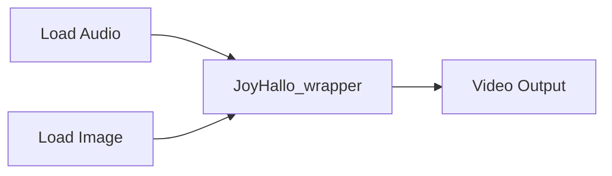

# ComfyUI-JoyHallo_wrapper

A ComfyUI custom node wrapper for [JoyHallo](https://github.com/jdh-algo/JoyHallo) - One-Shot Audio-Driven Talking Head Generation.

#### Simple workflow


#### JoyHallo_wrapper + kokoro


## Features

- One-shot audio-driven talking head generation
- Audio-driven video synthesis with lip synchronization
- Based on Stable Diffusion and audio processing models
- Face detection and landmark tracking
- Simple integration with ComfyUI workflow

## Installation

1. Install ComfyUI custom node:
```bash
cd ComfyUI/custom_nodes
git clone https://github.com/ShmuelRonen/ComfyUI-JoyHallo_wrapper
cd ComfyUI-JoyHallo_wrapper
pip install -r requirements.txt
```

2. Models:
- On first run, models download automatically to `models/JOY/HALLO/`
- Required space: ~10GB

## Manual Model Installation

If automatic download fails, you can manually install models:

1. Install git-lfs:
```bash
git lfs install
```

2. Download models to `ComfyUI/models/JOY/HALLO/`:
```bash
# Base model
git clone https://huggingface.co/fudan-generative-ai/hallo pretrained_models

# Wav2Vec model
git clone https://huggingface.co/TencentGameMate/chinese-wav2vec2-base

# JoyHallo model
git clone https://huggingface.co/jdh-algo/JoyHallo-v1 pretrained_models/joyhallo
```

Final structure should be:
```
ComfyUI/models/JOY/
└── HALLO/
    ├── stable-diffusion-v1-5/
    ├── chinese-wav2vec2-base/
    └── JoyHallo-v1/
```
### Suggested environment

```
pytorch version: 2.4.0+cu121
xformers version: 0.0.27.post2
Python version: 3.12.7
```
## Node Parameters

- **inference_steps** (10-40): Controls generation quality and detail. Higher values give better quality but slower processing. Default: 40

- **cfg_scale** (1.0-5.0): Controls how closely the output follows the audio/motion guidance. Higher values create stronger motion but may look less natural. Default: 3.5

- **if_fp8**: Enables 8-bit floating point optimization. May improve performance with minimal quality loss. Default: false

- **seed**: Controls randomization for reproducible results. Same seed + inputs = same output. Default: random

- **control_after_generate**: Options for post-generation behavior. "randomize" changes seed after each generation.

## Inputs/Outputs

Inputs:
- audio: Voice audio file (.wav)
- image: Reference face image (best results with 1:1 aspect ratio)

Outputs:
- images: Generated video frames
- audio: Synchronized audio

## Best Practices
- Use portrait images with 1:1 or 3:2 aspect ratio for optimal results
- Ensure clear facial features in reference image
- Use clean audio input without background noise

## Example Workflow



## Credits & License

This is a wrapper for [JoyHallo](https://github.com/jdh-algo/JoyHallo) by jdh-algo, following their original [license](https://github.com/jdh-algo/JoyHallo/blob/main/LICENSE).

Key components:
- JoyHallo: One-shot talking head generation
- [chinese-wav2vec2-base](https://huggingface.co/TencentGameMate/chinese-wav2vec2-base)
- Face analysis models
- Motion modules based on Stable Diffusion

## Citation

```bibtex
@article{jin2024joyhallo,
  title={JoyHallo: One-Shot Arbitrary-Face Audio-Driven Talking Head Generation}, 
  author={Junhao Jin and Tong Yu and Boyuan Jiang and Zhendong Mao and Yemin Shi},
  year={2024},
  journal={arXiv preprint arXiv:2401.17221},
}
```
